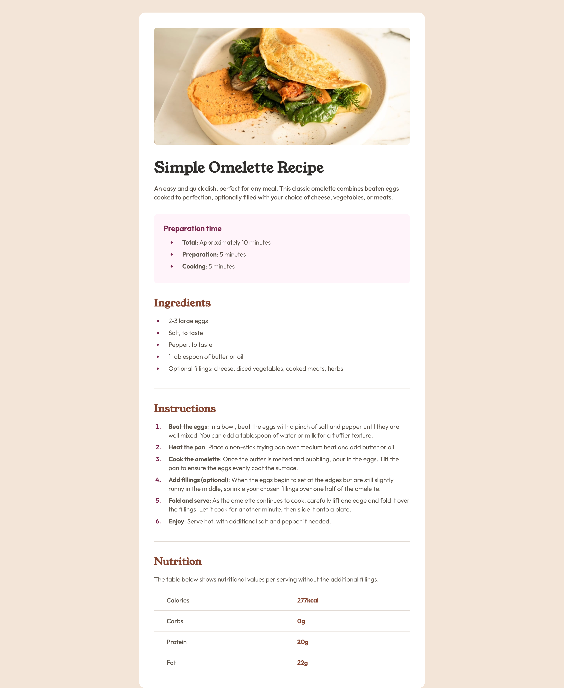
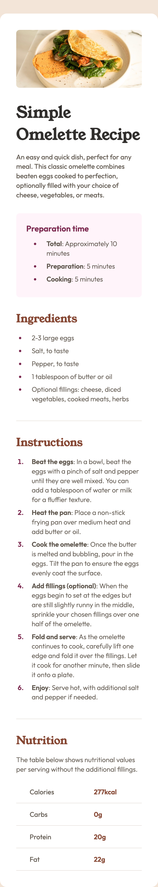

# Frontend Mentor - Recipe page solution

This is a solution to the [Recipe page challenge on Frontend Mentor](https://www.frontendmentor.io/challenges/recipe-page-KiTsR8QQKm). Frontend Mentor challenges help you improve your coding skills by building realistic projects. 

## Table of contents

- [Overview](#overview)
  - [The challenge](#the-challenge)
  - [Screenshot](#screenshot)
  - [Links](#links)
- [My process](#my-process)
  - [Built with](#built-with)
  - [What I learned](#what-i-learned)

**Note: Delete this note and update the table of contents based on what sections you keep.**

## Overview

### Screenshot

### Links

- Solution URL: (https://github.com/Jack-OC/Recipe-Card)
- Live Site URL: (https://jack-oc.github.io/Recipe-Card/)

## My process

### Built with

- Semantic HTML5 markup
- CSS custom properties
- Flexbox

### What I learned

This was another good exercise to get more comfortable with using CSS. It wasn't terribly difficult, but I initially found it difficult to make the marker box of a list item match the design without changing the properties for the rest of the list item. At first when I changed the font weight and colour of the list item it would all change. To avoid having to put the text in the list item in their own HTML elements to have each section of the list item have different properties, I used the ::marker selector to change the properties of the marker box have its colour and font weight.
